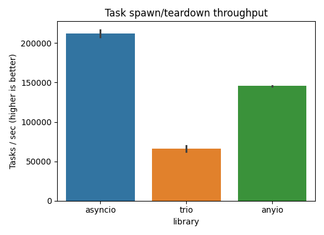
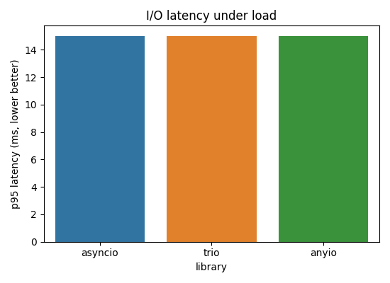
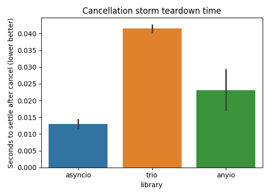

# Python Async Tools Research

Benchmarks and qualitative notes comparing `asyncio`, `trio`, and `anyio` (Python 3.13).

## Executive takeaways
- `asyncio` was quickest at raw task churn (≈210k tasks/s) and cancelled large task sets fastest.
- `anyio` landed in the middle on task churn and cancellation, while matching `asyncio` on simulated I/O throughput.
- `trio` lagged on spawn-heavy workloads but kept similar I/O latency; its structured concurrency and cancel scopes remain appealing despite slower teardown.
- All three delivered similar steady-state I/O latency (p95 ≈15 ms for the simulated workload).

## How each library thinks
- **asyncio**: event-loop centric; tasks via `asyncio.create_task`; cooperative cancellation with `task.cancel()` raising `CancelledError`; broad ecosystem and loop policy hooks (selectors, uvloop, etc.).
  ```python
  import asyncio

  async def main():
      async def worker(i):
          await asyncio.sleep(0.01)
          return i
      results = await asyncio.gather(*(asyncio.create_task(worker(i)) for i in range(100)))
      print(sum(results))

  asyncio.run(main())
  ```
- **trio**: structured concurrency first; nurseries own task lifetimes; cancellation via `CancelScope`; explicit timeouts and checkpoints (`cancel_scope.cancel()`, `trio.sleep(0)`); staples like `MemorySendChannel/ReceiveChannel`.
  ```python
  import trio

  async def main():
      async with trio.open_nursery() as nursery:
          for i in range(100):
              nursery.start_soon(worker, i)

  async def worker(i):
      await trio.sleep(0.01)
      print(i)

  trio.run(main)
  ```
- **anyio**: facade over asyncio/trio (defaults to asyncio here); `create_task_group` mirrors trio nurseries; unified primitives (`Event`, `Semaphore`, streams) and `move_on_after`/`fail_after` helpers for timeouts.
  ```python
  import anyio

  async def main():
      async with anyio.create_task_group() as tg:
          for i in range(100):
              tg.start_soon(worker, i)

  async def worker(i):
      await anyio.sleep(0.01)
      print(i)

  anyio.run(main)
  ```

### Concurrency primitives at a glance
- `asyncio`: `Lock`, `Event`, `Queue`, streams/socket APIs on the loop; supervision is manual (track tasks yourself or use `TaskGroup` from Py3.11+).
- `trio`: `open_nursery`, `CancelScope`, memory channels, `CapacityLimiter`, higher-level APIs for files/sockets built around cancel scopes.
- `anyio`: portable task groups and cancel scopes that map to the active backend; channels/streams mirror trio; can switch backends with `anyio.run(..., backend="trio")` while keeping the same surface.

### Error handling & cancellation notes
- `asyncio` propagates exceptions out of `gather` unless `return_exceptions=True`; cancellation is best-effort and relies on awaited points.
- `trio` cancels by cancelling a scope; nested scopes give fine-grained control; shield with a child `CancelScope(shield=True)`.
- `anyio` mirrors trio semantics on task groups even when running on asyncio backends; cancellation exceptions are backend-specific but retrievable via `anyio.get_cancelled_exc_class()`.

## Benchmarks
Benchmarks live in `src/python_async_tools/benchmarks/` and share the same interface per library via adapters in `backends.py`.

- **Task spawn/teardown (`task_spawn`)**: many tiny tasks that sleep for 0.5ms; metric = tasks/s and latency distribution.
- **Simulated I/O (`io_bound`)**: 200 workers × 200 operations with exponential sleep (mean 5ms); metrics = ops/s, p95/p99 latency.
- **Cancellation storm (`cancellation`)**: launch 5k long-lived tasks, cancel after 50ms; metric = time to settle cancellations.

Run everything (JSON saved to `results/latest.json`):
```bash
UV_CACHE_DIR=.uv-cache UV_PYTHON_INSTALL_DIR=.uv-python uv run python -m python_async_tools.runner
```
Regenerate plots from the latest results:
```bash
UV_CACHE_DIR=.uv-cache UV_PYTHON_INSTALL_DIR=.uv-python uv run python -m python_async_tools.plotting
```

## Results snapshot (Apple Silicon)
Embeddable PNGs are under `plots/` and referenced below.






### Observations
- Task churn: `asyncio` > `anyio` (asyncio backend) > `trio`. Trio’s structured scheduling adds overhead for huge fan-outs.
- Simulated I/O: throughput and tail latencies clustered tightly; minor variance likely scheduler noise.
- Cancellation: `asyncio` cancelled fastest in aggregate; `anyio` (on asyncio) close behind; `trio` took longer to settle many scopes.

### Interpreting the charts
- Throughput bars show aggregate work per second for each scenario.
- Latency charts show per-operation p95 values; lower is better.
- Cancellation chart shows time from issuing cancellation to the last task finishing teardown.

## Reproducing
Prereqs: `uv` installed, Python 3.13 available via uv (env already configured here).
1. Install dependencies (recorded in `pyproject.toml`):
   ```bash
   UV_CACHE_DIR=.uv-cache UV_PYTHON_INSTALL_DIR=.uv-python uv sync
   ```
2. Run benchmarks (customize via CLI flags, e.g., `--repetitions 3 --concurrency 500`).
3. Generate plots with `python -m python_async_tools.plotting`.

## Limitations & future work
- Benchmarks are single-machine and avoid real network I/O; integrating an HTTP echo server would expose event-loop I/O paths.
- No memory/RSS measurement; could add `psutil` sampling.
- Exploring anyio on the trio backend, `uvloop` for asyncio, and CPU-bound mixed workloads would broaden the story.
